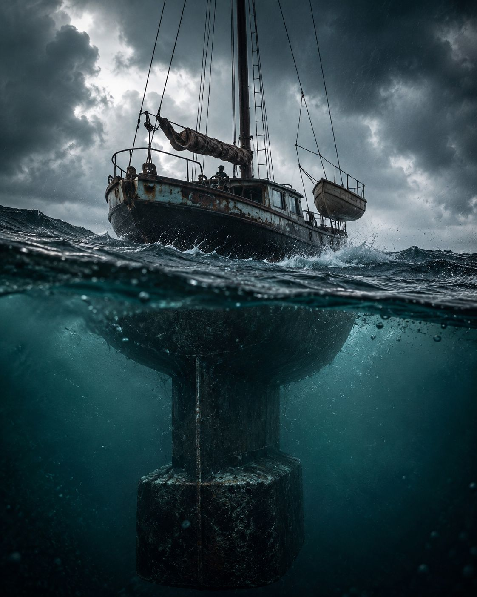

# Getting to Yes with Yourself — Image Prompt

## Post
https://lnkd.in/ex-qEbmU

## Image


## Prompt

```text
A single-masted ship holds dead still in open water during a gathering storm, shown in a cinematic half-submerged split view: above the surface, the visible rigging and an empty lifeboat sway loosely in the wind; below the surface, a massive iron keel and ballast sit fixed and unmoving deep in the hull, dark and submerged, doing the real work no one on deck can see. Rendered as moody, high-contrast documentary-style photography with a muted teal-and-rust color grade, evoking old maritime archive images. No crew is visible on deck; if any human silhouette appears at the ship's wheel, keep it small-scaled, turned away, with no facial detail. The storm's chop is violent and directional but the hull barely rocks, visually contradicting the chaos around it, because the ballast was set long before the storm arrived, not summoned by it or borrowed from anywhere outside the hull. Avoid: pill bottles, pharmaceutical packaging, recall-notice signage, boardroom tables, handshakes, scales of justice, stacks of cash, motivational-poster gloss, LinkedIn-meme aesthetics, and any recognizable portrait or likeness of a real named person. Output: ONE image, cinematic photographic style, 4:5 aspect ratio (LinkedIn feed crop), muted teal-and-rust color grade, no embedded text.
```
