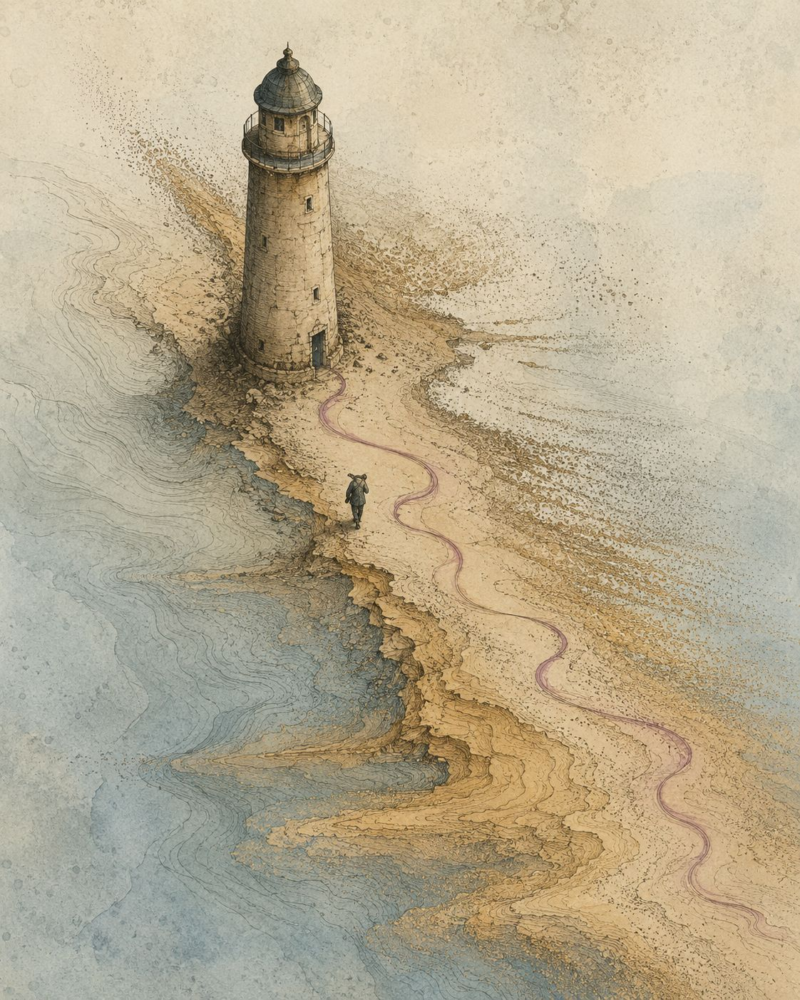

# Judgment That Remains — Image Prompt

## Post
https://www.linkedin.com/posts/hosseinzolfi_artificialintelligence-softwareengineering-share-7480649650329423872-eFhw/

## Image


## Prompt

```text
An editorial illustration in the style of a naturalist scientific diagram crossed with a topographic erosion map: a single lighthouse-like stronghold stands on a narrow spit of ground that is visibly dissolving into fine granular particulate at its edges, the surrounding land eroding away in soft directional streaks as though being steadily taken, slice by slice, rather than destroyed all at once. Instead of a beam of light, the stronghold gives off a faint, visible trail rendered as a thin curling ribbon of vapor close to the ground, the way a scent trail would move rather than a light would shine, curving low across the eroding terrain. A single small, scale-figure with no facial detail stands at the base of the stronghold, head slightly lowered, following that low trail rather than looking outward for a visible threat, one hand resting at the shoulder as if carrying something that cannot be set down. The palette stays muted and quiet rather than dramatic: soft, fading ochres and blues for the dissolving ground, with the scent-trail in one desaturated accent color, the only line in the image that is not eroding. No text. No robots, glowing technology, gavels, scales of justice, or circuitry. No dramatic lighting or stock-photo composition.

Output: ONE image, editorial illustration style, 4:5 vertical aspect ratio for LinkedIn feed display.
```
